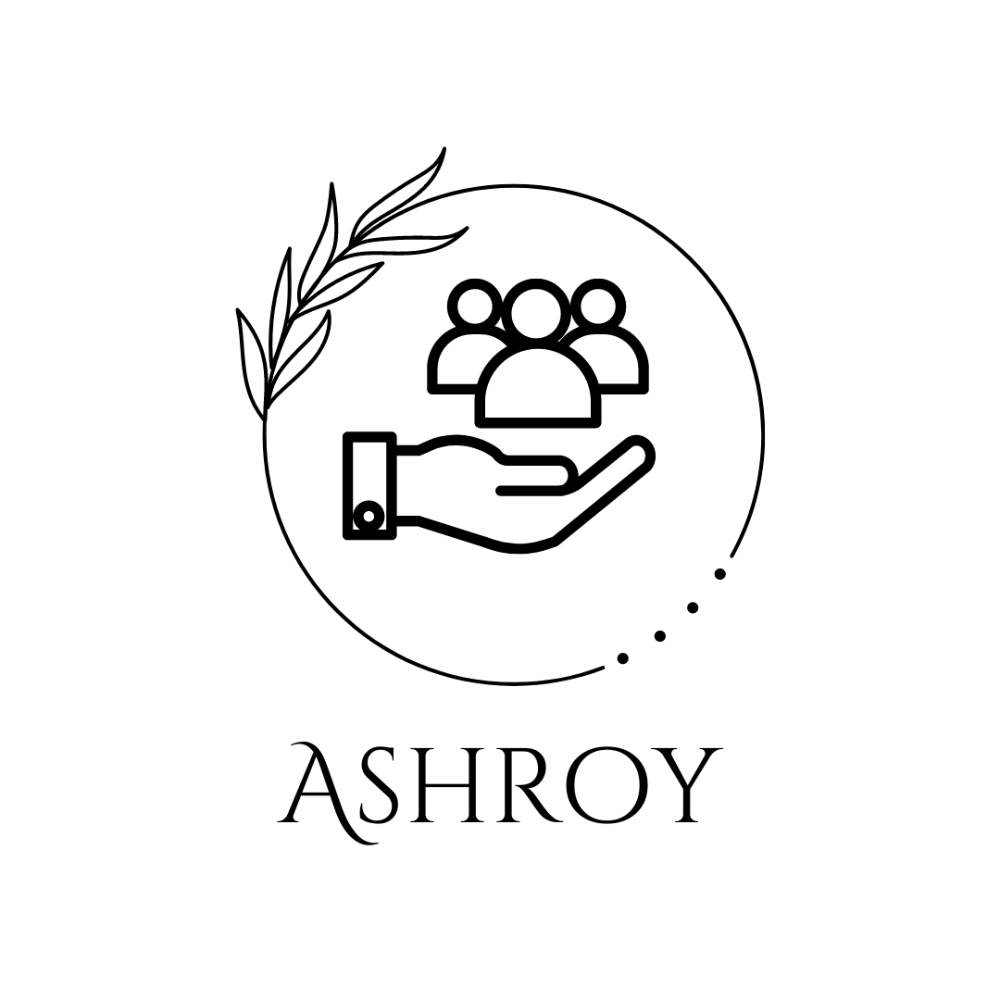

<div align='center'>
  
</div>

# Ashroy

Ashroy is a web application aimed at listing orphanages, animal welfare organizations, elderly homes, and shelter homes all in one place. This project is built using ReactJS, Vite, Bootstrap, Firebase, React Toastify and TypeScript.

## Table of Contents

- [Introduction](#introduction)
- [Features](#features)
- [Technologies Used](#technologies-used)
- [Installation](#installation)
- [Usage](#usage)
- [Contributing](#contributing)
- [License](#license)
- [Contact](#contact)

## Introduction

Ashroy aims to provide a comprehensive and accessible platform where users can find detailed information about various orphanages, animal welfare organizations, elderly homes, and shelter homes. The project leverages modern web technologies to deliver a fast and user-friendly experience.

## Features

- List orphanages, animal welfare organizations, elderly homes, and shelter homes.
- View detailed information about each organization.
- User authentication to manage data.
- Add new organizations (authenticated users).

## Technologies Used

- **ReactJS**: A JavaScript library for building user interfaces.
- **Vite**: A build tool that provides a faster and leaner development experience for modern web projects.
- **Bootstrap**: A CSS framework for developing responsive and mobile-first websites.
- **Firebase**: A platform developed by Google for creating mobile and web applications.
- **React Toastify**: A React library to add alerts to your app with ease.
- **TypeScript**: A typed superset of JavaScript that compiles to plain JavaScript.

## Installation

Follow these steps to set up the project locally:

1. **Clone the repository:**

   ```bash
   git clone https://github.com/debajit13/ashray-demo
   cd ashroy
   ```

2. **Install dependencies:**

   ```bash
   npm install
   ```

3. **Configure Firebase:**

   Create a `firebaseConfig.ts` file in the `src` directory and add your Firebase configuration:

   ```typescript
   import { initializeApp } from 'firebase/app';
   import { getDatabase } from 'firebase/database';
   import { getAuth } from 'firebase/auth';

   const firebaseConfig = {
     apiKey: 'YOUR_API_KEY',
     authDomain: 'YOUR_AUTH_DOMAIN',
     databaseURL: 'YOUR_DATABASE_URL',
     projectId: 'YOUR_PROJECT_ID',
     storageBucket: 'YOUR_STORAGE_BUCKET',
     messagingSenderId: 'YOUR_MESSAGING_SENDER_ID',
     appId: 'YOUR_APP_ID',
   };

   const app = initializeApp(firebaseConfig);
   const database = getDatabase(app);
   const auth = getAuth(app);

   export { database, auth };
   ```

4. **Run the development server:**

   ```bash
   npm run dev
   ```

   The application should now be running at `http://localhost:5173`.

## Usage

To use Ashroy, follow these steps:

1. Open the application in your web browser.
2. Browse through the list of orphanages, animal welfare organizations, elderly homes, and shelter homes.
3. Click on an organization to view detailed information.
4. If you have an account, log in to add new organizations or manage existing ones.

## Contributing

We welcome contributions to Ashroy! Here’s how you can contribute:

1. **Fork the repository**: Click the "Fork" button at the top of this repository.
2. **Clone your fork**:

   ```bash
   git clone https://github.com/yourusername/ashroy.git
   cd ashroy
   ```

3. **Create a branch**:

   ```bash
   git checkout -b feature/YourFeatureName
   ```

4. **Make your changes**: Implement your feature or fix a bug.
5. **Commit your changes**:

   ```bash
   git commit -m 'Add some feature'
   ```

6. **Push to the branch**:

   ```bash
   git push origin feature/YourFeatureName
   ```

7. **Create a Pull Request**: Go to the original repository and create a pull request to merge your changes.

## License

This project is licensed under the MIT License. See the [LICENSE](LICENSE) file for details.

## Contact

If you have any questions, feel free to contact us at [mallickdebajit3@gmail.com].
